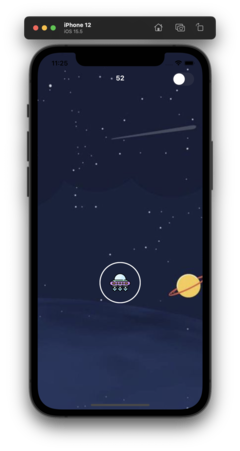
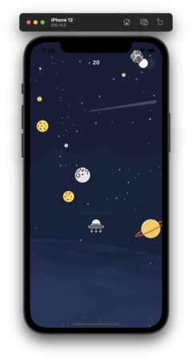

# Falling blocks

## About this game

This game is an experiment to create a simple game where objects are falling continuously. I didn't know what kind of game should I build so in this first approach it will be about avoiding those falling blocks.

## Screenshots and video

Screen 1             |  Screen 2             |  Video             |  
:-------------------------:|:-------------------------:|:-------------------------:|
  |   |   | 

## Problems solving
### Phase 1 - **Fall of random objects**

The first problem is how to make those rocks fall from different random locations. For this reason the following code generate UIView with a random X position and then creates an animation from starting point (x, -200) to final point (x, screen.height + 200). And finally we remove this UIView.

```swift
func throwRock() {
	let randomW = Int.random(in: 10..<200)
	let randomX = Int(arc4random_uniform(UInt32(UIScreen.main.bounds.width))) - Int(randomW / 2)
	let rock = UIImageView(frame: CGRect(x: randomX, y: -200, width: 50, height: 50))
	rock.image = UIImage(named: "meteor")
	self.rocks.append(rock)
	self.view.addSubview(rock)
	UIView.animate(withDuration: 3, delay: TimeInterval(2), options: .curveLinear) {
	    rock.frame.origin.y =  rock.frame.origin.y + UIScreen.main.bounds.height + 200
	} completion: { _ in
		self.rocks.removeFirst()
		rock.removeFromSuperview()
	}
}
```

Ok this code is great but it just generate one object, ¿How do you generate infinite objects?. We can make this by creating a Timer. This timer has an interval of 0.5 that we can modify to make it more dificult.

```swift
timerRocks = Timer.scheduledTimer(withTimeInterval: 0.5, repeats: true, block: { _ in
    self.throwRock()
})
```

### Phase 2 - **Track user**

We have rocks falling and now we should have user interaction. So we will use PAN gesture. For those not familiar with this gesture is whe the user must press one or more fingers on a view while panning on the screen. A panning gesture is on continuous action when the user moves one or more fingers allowed (minimumNumberOfTouches) to enough distance for recognition as a pan. It changes when the user moves a finger while pressing with the minimum number of fingers. At last, it ends (UIGestureRecognizer.State.ended) when the user lifts all fingers.

Add gesture
```swift
func addGesture(){
    let pan = UIPanGestureRecognizer(target: self, action: #selector(trackUser))
    player.isUserInteractionEnabled = true
    player.addGestureRecognizer(pan)
}
```

Track user movement. We set the spaceship to move with user´s finger.
```swift
@objc func trackUser(gesture: UIGestureRecognizer) {
    let fingerLocation = gesture.location(in: self.view)
    //we modify Y to see spaceship
    player.center = CGPoint(x: fingerLocation.x, y: fingerLocation.y - 40)
}
```

### Phase 3 - **Track collisions**

We have falling rocks and track user movements, last problem is when our spaceship collision with a rock. For this problem we will use the property **intersects** that indicates when 2 rectangles collide.

```swift
rectangle1.frame.intersects(rectangle2) 
```

Next problem that we should solve is how to detect rocks movement when they are inside UIView.animation. To solve this we will use **layer.presentation()?.frame** that indicates the current position in the screen.

```swift
view.layer.presentation()?.frame
```

Final result

```swift
func trackCollision() {
    let rocksOnScreen = rocks
    for rock in rocksOnScreen {
        guard let currentPosition = rock.layer.presentation()?.frame else{
            return
        }
        if player.frame.intersects(currentPosition) {
            endGame()
        }
    }
}
```


## License
[MIT](https://choosealicense.com/licenses/mit/)